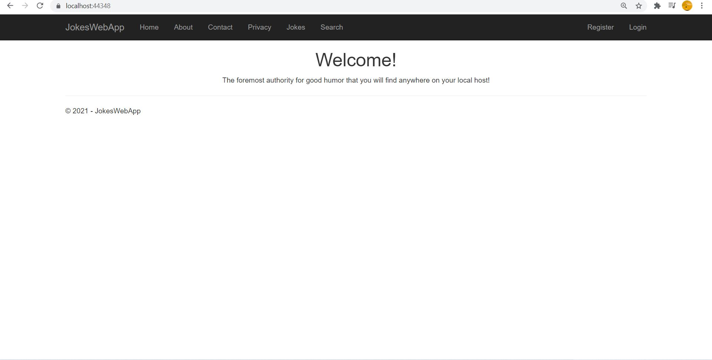
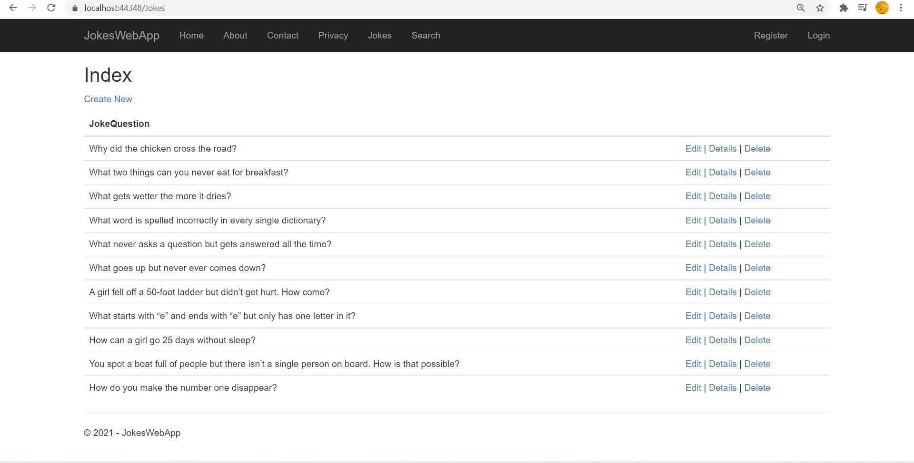
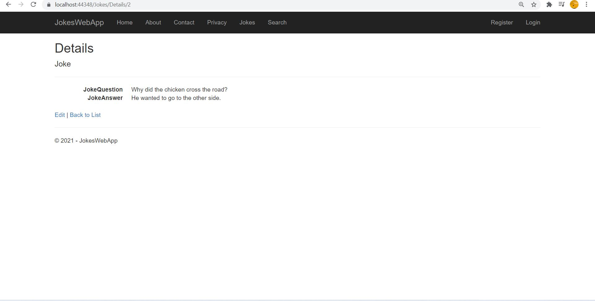
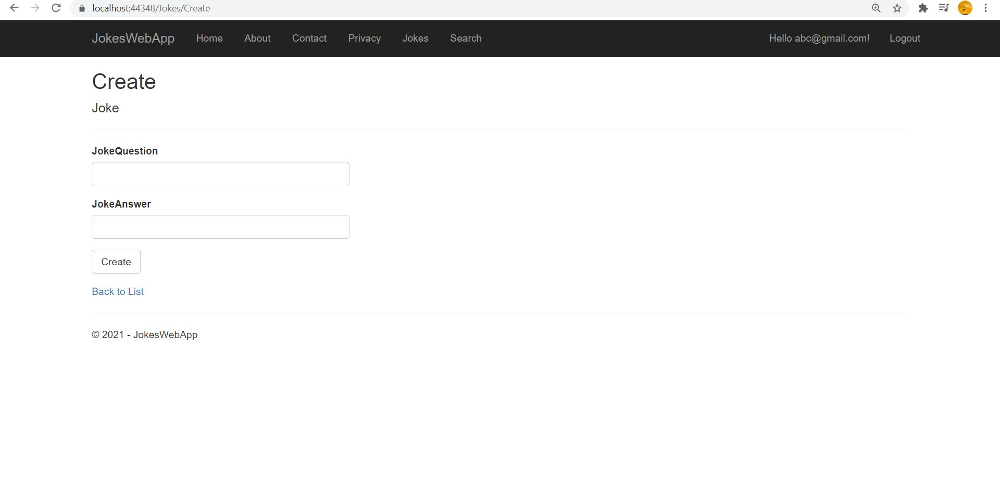
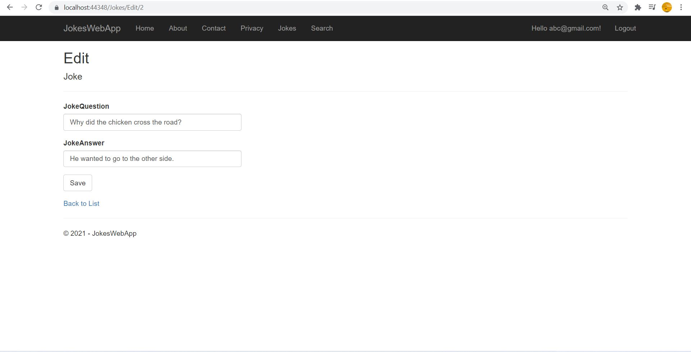
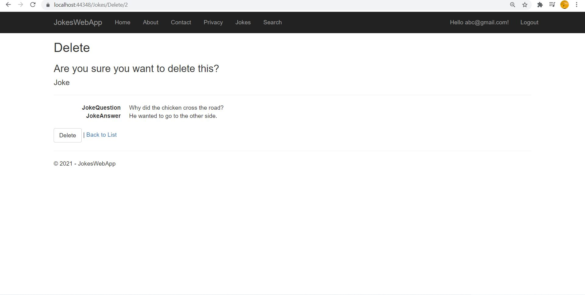
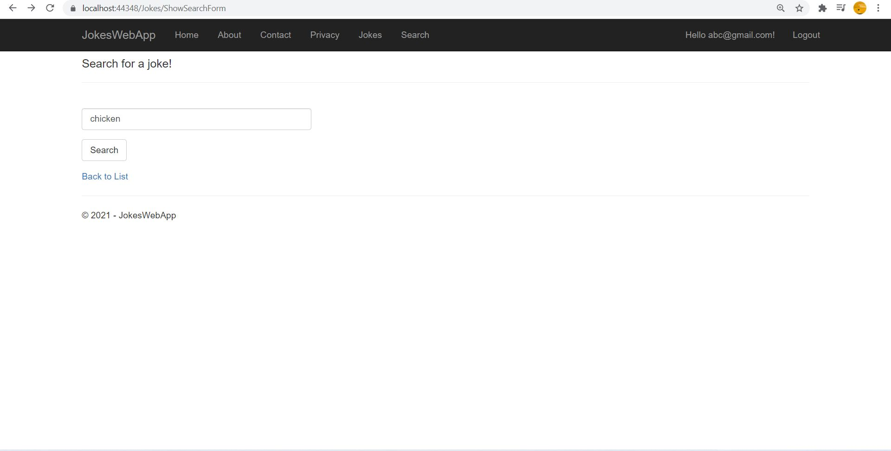

# JokesWebApp

My first ASP.NET MVC application with CRUD features.

This is a simple app which allows user to register a profile and create, read, update and delete(CRUD) jokes, and also consists a search feature based on a keyword. I have used MS SQL server to host the database. You need to create an account to create, edit or delete a joke. You can view the jokes as a guest!

This is home page.

Index page of Jokes. A guest can see the page.

Details page of Jokes is where the user can see the answer and question part of the joke. This will be accesible to guests.

Create page of Jokes. This will not be accessible to guests so you have to register and log in to continue!

Edit page of Jokes. This will also be only accesible to users who have created their account!

Delete page of Jokes. This will also be only accesible to users who have created their account!

Search page of Jokes. Here user can enter a keyword and jokes containing that particular keyword will be displayed in a list. This will be accesible to guests.

